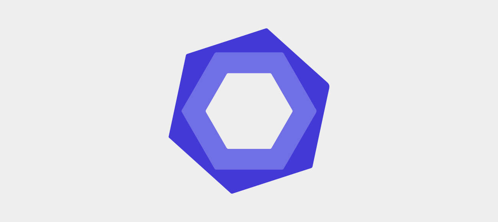

**Hi, I'm Okikiola, a Compulsive Developer  (She/her)**<span style="padding-right:15px">
</span>

```
  $ whoami

   Job Status                           | Available for Hire.
   I'm a Freelance full-Stack developer | JavaScript, Ruby, Ruby on Rails, React, Redux enthusiast.
                                        | Open source lover & Compulsive coder.

```
<p>
  <strong>Talking about personal stuffs:</strong>
</p>
<ul>
  <li> I'm currently working on React.
  <code>
     
  </code>
  </li>
  <li>
    <code>
      
    </code>
      I'm currently learning something cool.
  </li>
  <li>
    <code>
      
    </code>
    Ask me about anything, I'll love to hear from you.

If you want to say hi, I'll be happy to meet you. Let's code together!!
  </li>
</ul>

**Languages and Tools**

<p>
  <code>
    
  </code>
  <code>
    <span>
      
    </span>
  </code>
  <code>
    <span>
      
    </span>
  </code>
  <code>
    <span>
      
    </span>
  </code>
  <code>
    <span>
      
    </span>
  </code>
  <code>
    <span>
      
    </span>
  </code>
  <code>
    <span>
      
    </span>
  </code>
  <code>
    <span>
      
    </span>
  </code>
  <code>
    <span>
      
    </span>
  </code>
  <code>
    <span>
      
    </span>
  </code>
  <code>
    <span>
      
    </span>
  </code>
  <code>
    <span>
      
    </span>
  </code>
  <code>
    <span>
      
    </span>
  </code>
  <code>
    <span>
      
    </span>
  </code>
  <code>
    <span>
      
    </span>
  </code>
  <code>
    <span>
      
    </span>
  </code>
  <code>
    <span>
      
    </span>
  </code>
  <code>
    <span>
      
    </span>
  </code>
</p>

&nbsp;

**<code>
  </code>Github Stats**


